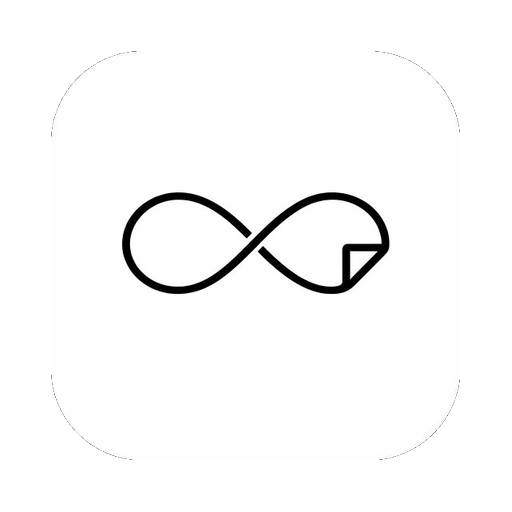

<div align="center">
  

  <h1>Infinito</h1>

  <p><strong>A minimalist note-taking app with an infinite canvas</strong></p>

  <p>
    <em>Write. Draw. Think without limits.</em>
  </p>

  <p>
    <a href="https://electronjs.org">
      
    </a>
    <a href="https://react.dev">
      
    </a>
    <a href="https://www.typescriptlang.org">
      
    </a>
    <a href="https://pnpm.io">
      
    </a>
    <a href="https://codecov.io/gh/blas-works/infinito">
      
    </a>
  </p>

  <p>
    <a href="#-features">Features</a> •
    <a href="#-installation">Installation</a> •
    <a href="#-development">Development</a>
  </p>
</div>

---

## ✨ Features

| 📝 **Daily Notes**          | Markdown support with GFM (tables, strikethrough, task lists)                                                                                 |
| :-------------------------- | :-------------------------------------------------------------------------------------------------------------------------------------------- |
|                             | Syntax highlighting with rehype-highlight                                                                                                     |
|                             | Mermaid diagram rendering in code blocks                                                                                                      |
|                             | Date-based organization with collapsible groups                                                                                               |
|                             | Search/filter with `Ctrl+P` / `Cmd+P` shortcut                                                                                                |
|                             | Image paste from clipboard (auto base64)                                                                                                      |
|                             | Interactive checkboxes in rendered markdown                                                                                                   |
| 📄 **Notes**                | Full markdown editor with edit/preview toggle                                                                                                 |
|                             | Multiple named sessions with scrollable tabs                                                                                                  |
|                             | Create, rename, and delete note documents                                                                                                     |
| 🎨 **Canvas**               | Excalidraw-powered infinite canvas                                                                                                            |
|                             | Multiple named sessions with scrollable tabs                                                                                                  |
|                             | Shape tools, text elements, and freehand drawing                                                                                              |
| ⚙️ **Editor Configuration** | 8 font families (Inter, JetBrains Mono, Fira Code, Source Code Pro, IBM Plex Mono, Cascadia Code, Geist Mono, System)                         |
|                             | 7 font sizes (11–17px)                                                                                                                        |
|                             | 12 syntax themes (Tokyo Night, Dracula, Nord, Catppuccin, Gruvbox, One Dark, Monokai, Rose Pine, Ayu Dark, GitHub Dark, Solarized Dark, Zinc) |
|                             | Ligatures toggle for programming fonts                                                                                                        |
|                             | 3 content widths (Narrow, Wide, Full) for large windows                                                                                       |
| 🖥️ **macOS Features**       | Menu bar mode with compact window for quick access                                                                                            |
|                             | Always-on-top window pinning                                                                                                                  |
|                             | Homebrew-based auto-update with animated overlay                                                                                              |
| 🔄 **Automatic Updates**    | 3 priority levels: normal, security, and critical (with countdown timer)                                                                      |
|                             | Manual check and snooze options                                                                                                               |
| 💾 **Local Storage**        | Private data stored locally, no cloud required                                                                                                |
|                             | SQLite database with Drizzle ORM                                                                                                              |
|                             | Offline-first design, privacy-focused                                                                                                         |
| 🪟 **Window**               | Custom frameless window with native-like controls                                                                                             |
|                             | Single instance lock                                                                                                                          |
|                             | Animated transitions with Framer Motion                                                                                                       |

## 🚀 Installation

### Homebrew (macOS/Linux)

Install Infinito via [Homebrew](https://brew.sh):

**Option 1 — Add tap first (recommended):**

```bash
brew tap blas-works/apps
brew install --cask infinito
```

**Option 2 — One-liner without tap:**

```bash
brew install --cask blas-works/apps/infinito
```

To upgrade to the latest version:

```bash
brew upgrade --cask infinito
```

### Manual Download

Download the latest version from [GitHub Releases](https://github.com/blas-works/infinito/releases/latest).

| Platform    | Architecture  | Format                    |
| ----------- | ------------- | ------------------------- |
| **Windows** | x64           | `.exe` (NSIS)             |
| **Linux**   | x64           | `.AppImage` `.deb` `.rpm` |
| **macOS**   | Apple Silicon | `.dmg`                    |
| **macOS**   | Intel         | `.dmg`                    |

### Development

#### Prerequisites

- **Node.js** 22.x (see `.nvmrc`)
- **pnpm** 11

#### Quick Start

```bash
# Clone the repository
git clone https://github.com/blas-works/infinito.git
cd infinito

# Install dependencies
pnpm install

# Run in development mode
pnpm run dev
```

<details>
<summary><b>📖 Development Scripts</b></summary>

| Command                 | Description                        |
| ----------------------- | ---------------------------------- |
| `pnpm run dev`           | Development server with hot reload |
| `pnpm run build`         | Production build (auto-detects OS) |
| `pnpm run build:win`     | Build for Windows (.exe)           |
| `pnpm run build:mac`     | Build for macOS (.dmg)             |
| `pnpm run build:linux`   | Build for Linux (.AppImage, .deb)  |
| `pnpm run test`          | Run tests in watch mode            |
| `pnpm run test:run`      | Run tests once                     |
| `pnpm run test:coverage` | Run tests with coverage report     |
| `pnpm run lint`          | Lint code with ESLint              |
| `pnpm run typecheck`     | Type check with TypeScript         |

</details>
